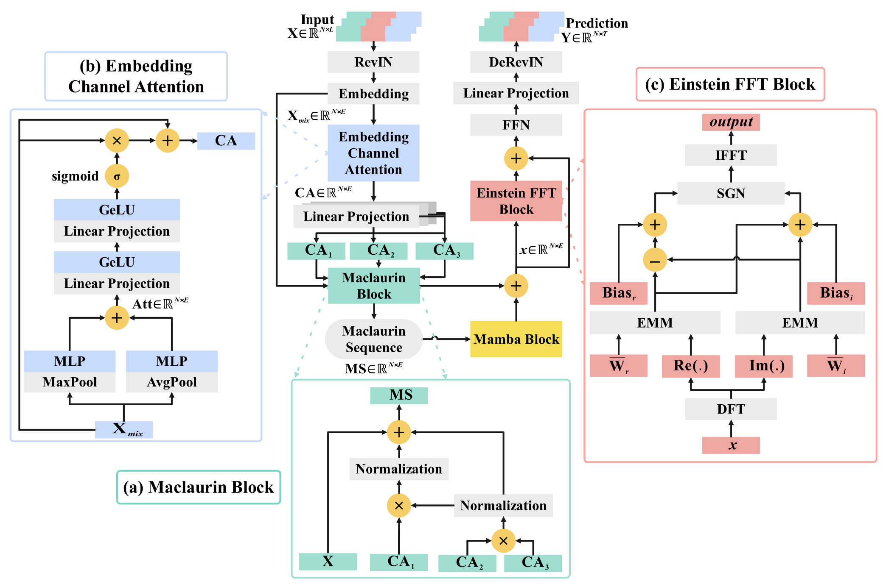

# 📢 CME-Mamba: Enhancing Nonlinear Dependencies of Mamba via Negative Feedback for Time Series Forecasting

[](DOI)

🙋 Sijie Xiong, Cheng Tang, Yuanyuan Zhang, Haoling Xiong, Youhao Xu, Atsushi Shimada.

🏫 Kyushu University, Xi'an Jiaotong Liverpool University, East China University of Science and Technology, Southeast University.

# 🎉 Latest News

- **01-June-2025** Under Review: Revision.

# 🌟 CME-Mamba



# 🏆 Contributions

- We originally design a specific block according to negative feedback mechanisms, the Maclaurin block, enhancing linear and nonlinear dependencies for Mamba-based models. Based on Maclaurin modules, a novel Mamba-based framework, CME-Mamba is proposed for TSF tasks. In CME-Mamba, extra nonlinear dependencies are captured by the Embedding Attention block and the Maclaurin block with partial components of Maclaurin Series employed.
- Extensive experiments are conducted to compare the performance of CME-Mamba with SOTA Transformer-based models, Linear-based models, and Mamba-based models. The results reveal that CME-Mamba successfully captures more nonlinear dependencies. It is evident that CME-Mamba possesses excellent performance in datasets with large numbers of variates, e.g., PEMS.
- Massive ablation experiments are implemented to verify the effectiveness of each individual block. Our findings list the order of contributions as follows: the Embedding Attention block, the Einstein FFT block, and the Maclaurin block. Moreover, there exists a synergy effect between the Embedding Channel Attention block and the Maclaurin block. Emerging issues are highlighted and outlined at the end of this project to inspire future work.

# ☀️ Follow Me and Find Yourselves

## 🔧 Environment Installation

`pip install -r requirements.txt`

⚠️ Although our work is built upon  with , we sincerely recommend users to work on an Ubuntu platform. Otherwise, it will take a lot of time to resolve the compatibility across 📦**mamba-ssm** and 🖥️ **system**.

## 📊 Datasets

- Electricity, ETT, PEMS datasets are provided. Users can get them after ▶️`git clone` our codehub.
- As for Solar-Energy, Traffic, Weather datasets, please ▶️`unzip (extract here) Solar.zip/traffic.zip/weather.zip` at users' comfortable ways.

🙏Our future work will contain more datasets, they probably will be sync updated here.

## 🚀 Train and Evaluate CME-Mamba

We have written special .sh files to manage the large number of experiments and configurations.

For example, users can follow the command format ▶️`bash ./.../CME_Mamba.sh`to train and evaluate CME-Mamba and their own models:

```bash
# ECL
bash ./scripts/multivariate_forecasting/ECL/CME_Mamba.sh
# Weather
bash ./scripts/multivariate_forecasting/Weather/CME_Mamba.sh
# Solar-Energy
bash ./scripts/multivariate_forecasting/SolarEnergy/CME_Mamba.sh
# ETT
bash ./scripts/multivariate_forecasting/ETT/CME_Mamba_ETTm1.sh
bash ./scripts/multivariate_forecasting/ETT/CME_Mamba_ETTm2.sh
bash ./scripts/multivariate_forecasting/ETT/CME_Mamba_ETTh1.sh
bash ./scripts/multivariate_forecasting/ETT/CME_Mamba_ETTh2.sh
# PEMS
bash ./scripts/multivariate_forecasting/PEMS/CME_Mamba_03.sh
bash ./scripts/multivariate_forecasting/PEMS/CME_Mamba_04.sh
bash ./scripts/multivariate_forecasting/PEMS/CME_Mamba_07.sh
bash ./scripts/multivariate_forecasting/PEMS/CME_Mamba_08.sh
```

For more configurations, please look into 📄`./scripts/multivariate_forecasting/**Dataset**/**CME_Mamba-{}-{}.sh**`.
CME-Mamba is implemented via  ▶️`README_CME_Mamba.md`

🌟The easiest way for users who want to make their own models, if you like, is to follow the same rules.

## ✅ Results

In CME-Mamba, all results will be stored in 📃 **result_long_term_forecast.txt** and the training processes will be stored in 📁 **train_records** directory.

🌟 Please develop analysis charts based on the results, and further customize or extend them according to users' specific needs. Herein, we reserve our own ones.

## 🍊 Code Flows

To have any potential user a better vision of our work, we would like to present a rough flow chart of our codehub. For more details, please look through related codes in detail.

Herein, we take CME-Mamba related codes as an example.


## 🙏Acknowledgement

We are sincerely grateful for the following awesome projects when implementing our CME-Mamba and they also inspire us to have CME-Mamba public to counterparts.

- 🙇 [Mamba](https://github.com/state-spaces/mamba)
- 🙇 [S-Mamba](https://github.com/wzhwzhwzh0921/S-D-Mamba)
- 🙇 [iTransformer](https://github.com/thuml/iTransformer)
- 🙇 [RLinear](https://github.com/plumprc/RTSF/tree/main)
- 🙇 [PatchTST](https://github.com/yuqinie98/PatchTST)
- 🙇 [Crossformer](https://github.com/Thinklab-SJTU/Crossformer)
- 🙇 [TiDE](https://github.com/google-research/google-research/tree/master/tide)
- 🙇 [TimeNet](https://github.com/paudan/TimeNet)
- 🙇 [DLinear](https://github.com/cure-lab/LTSF-Linear)
- 🙇 [FEDformer](https://github.com/DAMO-DI-ML/ICML2022-FEDformer)
- 🙇 [Autoformer](https://github.com/thuml/Autoformer)

## 📖 Citation

If you are fond of our work and consider our work helpful to your research, please cite us:

```
@article{xiong2025cme-mamba,
  title={{Enhancing Nonlinear Dependencies of Mamba via Negative Feedback for Time Series Forecasting}},
  author={Xiong, Sijie and Tang, Cheng and Zhang, Yuanyuan and Xiong, Haoling and Xu, Youhao and Shimada, Atsushi},
  journal={Applied Soft Computing},
  year={2025}
}
```

## 🤝 Academic Collaboration

We are warmly welcome potential collaborations with researchers around the world. This is not limited to new ideas, improvements, bug fixing etc.

We are open to interdisciplinary dialogue and collaboration across diverse academic fields, such as control, education, finance, biology, medicine design, etc.

If you have any intended passion to collaborate with us, please feel free to contact us by emails.

📮 [sijiexiongkyushu@gmail.com](sijiexiongkyushu@gmail.com)

📮 [limu-staff@limu.ait.kyushu-u.ac.jp](limu-staff@limu.ait.kyushu-u.ac.jp)
